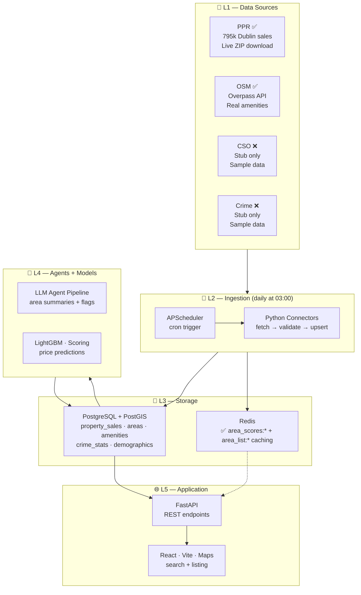
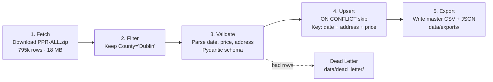

# TerraPulse

TerraPulse is an agentic AI platform for analyzing housing prices and neighborhood conditions in Dublin (with architecture ready to expand across Ireland). It combines structured data (property sales, amenities, crime, demographics) with unstructured text (agent-driven qualitative summaries) to provide unified scores and price predictions for specific geographic areas.

## Architecture Overview

TerraPulse is built on a 5-layer pipeline. Data flows from public sources through ingestion
into Postgres, where agents and ML models process it, and a FastAPI + React stack serves it.



### PPR connector pipeline (end-to-end)



### What each connector actually fetches

| Connector | Status | Real data? | Source |
|-----------|--------|-----------|--------|
| PPR | ✅ Working | Yes — 795k rows from PPR-ALL.zip | propertypriceregister.ie |
| OSM | ✅ Working | Yes — Overpass API | openstreetmap.org |
| CSO | ❌ Stub | No — 2 hardcoded sample rows | Needs CSO PxStat HPM04 + SAPS |
| Crime | ❌ Stub | No — 2 hardcoded sample rows | Needs CSO PxStat CJA01 |

*For complete details, see [docs/architecture.md](docs/architecture.md).*

---

## Prerequisites

To run the **full stack**:

- [Docker Desktop](https://www.docker.com/products/docker-desktop/) with Docker Compose
- A valid [Google Maps API Key](https://developers.google.com/maps/documentation/javascript/get-api-key) with the **Maps JavaScript API** enabled and billing attached
- An [OpenRouter API Key](https://openrouter.ai/) (only needed for running the agent pipeline; frontend/backend do not need it)

To run the **frontend alone** (mock data):

- [Node.js 20+](https://nodejs.org/)
- A Google Maps API Key

---

## Quick Start — Frontend Only (No Docker Required)

The frontend includes realistic mock data so you can explore the entire UI without a running backend or database.

1. **Clone the repository**
   ```bash
   git clone <repo-url>
   cd terrapulse
   ```

2. **Configure the frontend environment**
   ```bash
   cp .env.example .env
   # Edit .env and set VITE_GOOGLE_MAPS_API_KEY=your_actual_key
   ```

3. **Install frontend dependencies**
   ```bash
   cd frontend
   npm install
   ```

4. **Start the dev server**
   ```bash
   npm run dev
   ```

5. **Open the app**
   - Home page: http://localhost:5173
   - Search/map view: http://localhost:5173/search
   - Areas directory: http://localhost:5173/areas

> If Google Maps does not load, check that the Maps JavaScript API is enabled for your key, billing is active, and `localhost` is allowed in your key's HTTP referrer restrictions.

---

## Quick Start — Full Stack (Docker)

This runs Postgres + PostGIS, Redis, the FastAPI backend, and the Vite frontend together.

1. **Configure environment**
   ```bash
   cp .env.example .env
   # Edit .env and set:
   #   VITE_GOOGLE_MAPS_API_KEY=your_actual_key
   #   OPENROUTER_API_KEY=your_key   (only if running agents)
   ```

2. **Start the infrastructure**
   ```bash
   docker-compose up -d postgres redis
   docker compose ps
   ```
   Wait until `postgres` shows as `healthy`.

3. **Start the backend (migrations run automatically)**
   ```bash
   docker-compose up -d backend
   ```
   `storage/scripts/run_migrations.py` runs on every backend container
   start and is idempotent (tracks applied files in a `schema_migrations`
   table), so there's no separate manual migration step.

4. **Seed area boundaries**
   ```bash
   docker-compose exec backend python storage/seeds/seed_areas.py
   ```

5. **Run ingestion**
   ```bash
   # At minimum, fetch real property sales
   docker-compose exec backend python ingestion/jobs/run_ingestion.py --source ppr
   ```

6. **Start the backend and frontend**
   ```bash
   docker-compose up -d backend frontend
   ```

7. **Access the app**
   - Frontend: http://localhost:5173
   - Backend API Docs: http://localhost:8000/docs

---

## Backend Development (Without Docker)

If you prefer running Python directly:

1. **Install Python dependencies**
   ```bash
   python -m venv .venv
   source .venv/bin/activate  # On Windows: .venv\Scripts\activate
   pip install -r requirements.txt
   ```

2. **Start Postgres + Redis**
   You must provide your own Postgres 15+ with PostGIS and Redis instances. Set `DATABASE_URL` and `REDIS_URL` in `.env`.

3. **Run migrations and seed**
   ```bash
   psql "$DATABASE_URL" -f storage/migrations/001_init_postgis.sql
   # ... repeat for 002 through 007
   python storage/seeds/seed_areas.py
   ```

4. **Run ingestion**
   ```bash
   python ingestion/jobs/run_ingestion.py --source ppr
   ```

5. **Start the backend**
   ```bash
   python -m uvicorn backend.app.main:app --reload --port 8000
   ```

---

## Running Tests

### Frontend tests
```bash
cd frontend
npm install
npx vitest run
```

### Backend tests
```bash
# With Docker
docker-compose exec backend pytest backend/tests/

# Without Docker (requires DATABASE_URL)
pytest backend/tests/
```

---

## Environment Variables

Copy `.env.example` to `.env` and fill in at least the required values:

| Variable | Required for | Description |
|----------|-------------|-------------|
| `DATABASE_URL` | Backend + ingestion | Postgres connection string |
| `POSTGRES_USER` | Docker | Postgres user |
| `POSTGRES_PASSWORD` | Docker | Postgres password |
| `POSTGRES_DB` | Docker | Postgres database name |
| `REDIS_URL` | Backend caching | Redis connection string |
| `API_KEY` / `API_KEYS` | Backend auth | `X-API-Key` value(s); `API_KEYS` is an optional comma-separated list for rotation |
| `CORS_ALLOWED_ORIGINS` | Backend | Comma-separated list of allowed CORS origins |
| `AREA_SCORE_CACHE_TTL_SECONDS` / `AREA_LIST_CACHE_TTL_SECONDS` | Backend caching | Redis TTLs for score vs. list endpoints |
| `VITE_GOOGLE_MAPS_API_KEY` | Frontend | Google Maps JavaScript API key |
| `VITE_API_BASE_URL` | Frontend | Base URL for backend API (default: `http://localhost:8000`) |
| `OPENROUTER_API_KEY` | Agent pipeline | OpenRouter key for LLM summarization |
| `MODEL_REGISTRY_PATH` | Backend prediction | Path to persisted model registry |

---

## Project Structure

```
terrapulse/
├── backend/             # FastAPI application
├── frontend/            # React + Vite + Google Maps
├── ingestion/           # ETL connectors (PPR, OSM, CSO, crime)
├── storage/             # Postgres migrations, SQLAlchemy models, seeds
├── agents_layer/        # LLM-driven area summarization
├── models_layer/        # LightGBM price prediction + scoring
├── shared/              # Pydantic contracts shared across layers
└── data/                # Raw/processed/dead-letter output
```

---

## Data Ingestion: Current Issues

The ingestion design is sound but the layer is **not runnable in its current state**.
Below is a concise list of what needs to be fixed before data flows end-to-end.

### Blockers (must fix to run at all)

| # | Issue | Detail |
|---|-------|--------|
| 1 | **Postgres & Redis not running** | Ports 5432 and 6379 are closed. Nothing can be persisted or cached. |
| 2 | **Python venv is broken** | `.venv/bin/pip` missing, no deps installed. `run_ingestion.py` cannot import. |
| ~~3~~ | ~~No automated migration runner~~ | **Resolved.** `storage/scripts/run_migrations.py` is idempotent (tracks applied files in a `schema_migrations` table) and runs on every `backend`/`scheduler` container start (`backend/Dockerfile`). |
| 10 | **A single bad row aborts an entire ingestion run** | Every connector's `load()` (`ingestion/connectors/*.py`) catches DB errors but never calls `db.rollback()`. Postgres then sits in `InFailedSqlTransaction` for the rest of that connector's shared session, so **every subsequent record in the same run fails too** — e.g. a fresh-DB PPR run fetched 8199 real rows and upserted 0. Ingestion-layer bug, not fixed as part of the backend-hardening pass. |

### Efficiency & correctness gaps

| # | Issue | Detail |
|---|-------|--------|
| 4 | **PPR downloads full national zip every run** | `PPR-ALL.zip` is 795k rows / 18 MB — re-downloaded daily just to keep Dublin. No incremental/delta logic. |
| 5 | **PPR rows are not geocoded** | `area_id`, `lat`, `lon` are all `NULL` in `property_sales` after ingestion — so area-scoped scores cannot use PPR data. |
| 6 | **Redundant CSV copies, no cleanup** | Per-run files accumulate in `data/processed/ppr/` with no retention. Separate `manual_pulls/` and `data/exports/` add confusion. Only the master export (`data/exports/ppr_dublin_master.csv`) should be canonical. |
| 7 | **CSO & Crime connectors return fake data** | `cso_connector.py` and `crime_connector.py` both call `_get_sample_data()` — 2 hardcoded rows each. The real endpoints (CSO PxStat HPM04, CJA01, SAPS) are known and documented but never called. |
| 8 | **`ingestion_runs` never records row counts** | `rows_fetched`, `rows_upserted`, `rows_dead_lettered` stay at default 0. The table was built explicitly for queryable history but isn't fed. |
| ~~9~~ | ~~Redis cache invalidation is a no-op~~ | **Resolved.** `backend/app/core/cache.py` + `score_service.py`/`area_service.py`/`neighborhood_service.py` wire real, fail-soft Redis caching for both `area_scores:*` and `area_list:*` - see `.claude/skills/backend/SKILL.md` for the full key/TTL contract. |

### Missing connectors (from co-intern's data source catalog)

The citations document identifies 13 metric categories. Of those, only PPR and OSM are
wired. The following have identified sources but **no connector built yet**:

- CSO RPPI (monthly price index by Eircode — separate from PPR transactions)
- CSO Census SAPS (population density, demographics)
- CSO CJA01 (recorded crime via PxStat API)
- NTA GTFS/GTFS-R (transport links, commute times)
- Dublin planning portals (active construction projects)
- Dublin City Council flood maps
- School counts (Dept of Education, Schooldays.ie)

---

## Known Limitations

- **Coverage**: Data ingestion is currently bounded to Dublin, though the schema is designed for Ireland-wide expansion.
- **Crime Data Resolution**: Garda crime statistics are only available at the division level, not finer neighborhood granularity.
- **Agent Text Sources**: Unstructured agent summaries are limited to the text sources scraped during ingestion; the agent does not perform live web searches during inference.
- **Mock Data Mode**: The frontend can run with mock data when no backend is available, so some displayed numbers are illustrative rather than live.

---

## License

[Add your license here]
