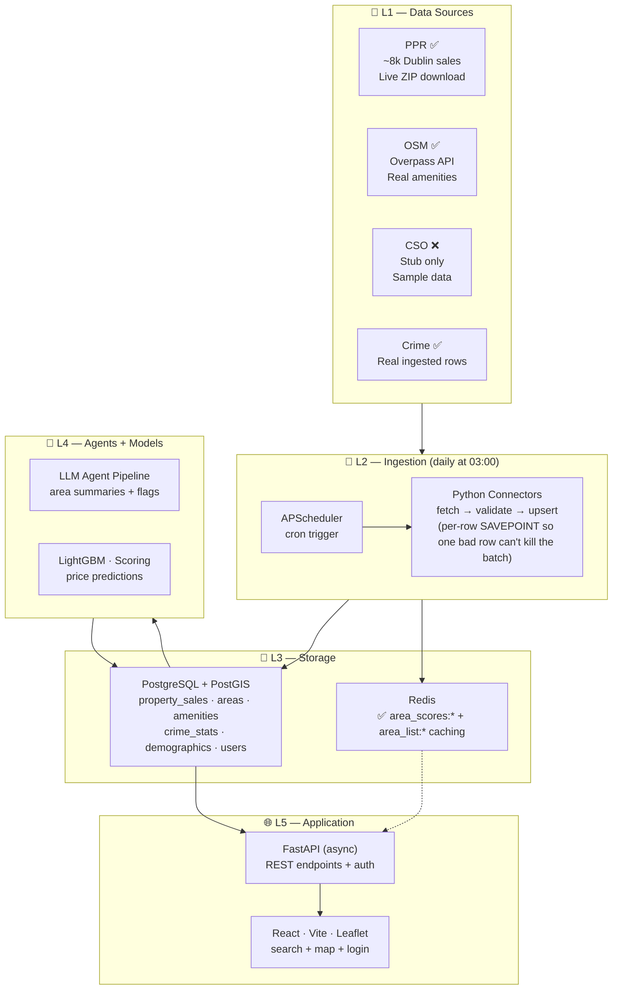
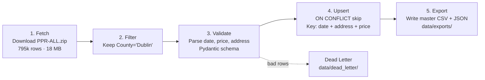

# TerraPulse

TerraPulse is an agentic AI platform for analyzing housing prices and neighborhood conditions in Dublin (with architecture ready to expand across Ireland). It combines structured data (property sales, amenities, crime, demographics) with unstructured text (agent-driven qualitative summaries) to provide unified scores and price predictions for specific geographic areas.

**One-sentence pitch:** it's a property-intelligence app — pick an area of Dublin (or search a specific sold property) and see a livability/price score built from real government data, plotted on a map.

## What it does, in plain words

- Pulls **real historical property sale prices** for Dublin from Ireland's official Property Price Register (PPR).
- Combines that with **amenities** (shops, transport, schools — from OpenStreetMap), **crime stats**, and **demographics** for each area.
- Turns those numbers into a single **area score** (affordability, safety, etc.) and a **price prediction** model (LightGBM).
- An **LLM agent layer** can write qualitative text summaries about an area.
- All of it is served through a **FastAPI backend** + **React/Leaflet map frontend**, so a user can browse Dublin on a map, search sold properties, filter by area/price/date, and see scores.
- Users can **sign in** (email/password or Google OAuth) — added recently by a teammate.

## How to explain the architecture in an interview

Five layers, data flows top to bottom:

1. **Data Sources (L1)** — external sources: PPR (property sales), OpenStreetMap (amenities), CSO (demographics), Garda crime stats.
2. **Ingestion (L2)** — Python "connectors," one per source, run daily by a scheduler (APScheduler). Each connector: fetch → validate (Pydantic) → upsert into Postgres. Bad rows go to a dead-letter folder instead of crashing the run.
3. **Storage (L3)** — PostgreSQL + PostGIS (stores geography/polygons for areas) is the source of truth; Redis caches expensive-to-compute results (area scores, list endpoints) so the API doesn't recompute them on every request.
4. **Agents + Models (L4)** — LightGBM model predicts prices; a scoring service computes affordability/safety scores from formulas; an LLM agent pipeline (via OpenRouter) generates area summaries.
5. **Application (L5)** — FastAPI serves REST endpoints; React (Vite) + Leaflet renders the map/search UI and calls those endpoints.


```mermaid
flowchart TD
    subgraph L1["📡 L1 — Data Sources"]
        direction LR
        PPR["PPR ✅<br/>~8k Dublin sales<br/>Live ZIP download"]
        OSM["OSM ✅<br/>Overpass API<br/>Real amenities"]
        CSO["CSO ❌<br/>Stub only<br/>Sample data"]
        CRIME["Crime ✅<br/>Real ingested rows"]
    end

    subgraph L2["🔄 L2 — Ingestion (daily at 03:00)"]
        CONN["Python Connectors<br/>fetch → validate → upsert<br/>(per-row SAVEPOINT so one bad row can't kill the batch)"]
        SCHED["APScheduler<br/>cron trigger"]
        SCHED --> CONN
    end

    subgraph L3["💾 L3 — Storage"]
        PG["PostgreSQL + PostGIS<br/>property_sales · areas · amenities<br/>crime_stats · demographics · users"]
        REDIS["Redis<br/>✅ area_scores:* + area_list:* caching"]
    end

    subgraph L4["🤖 L4 — Agents + Models"]
        AG["LLM Agent Pipeline<br/>area summaries + flags"]
        ML["LightGBM · Scoring<br/>price predictions"]
    end

    subgraph L5["🌐 L5 — Application"]
        API["FastAPI (async)<br/>REST endpoints + auth"]
        UI["React · Vite · Leaflet<br/>search + map + login"]
    end

    L1 --> L2
    L2 --> PG
    L2 --> REDIS
    PG --> L4
    L4 --> PG
    PG --> API
    REDIS -.-> API
    API --> UI
```

### PPR connector pipeline (end-to-end)


```mermaid
flowchart LR
    A["1. Fetch<br/>Download PPR-ALL.zip<br/>795k rows · 18 MB"]
    B["2. Filter<br/>Keep County='Dublin'"]
    C["3. Validate<br/>Parse date, price, address<br/>Pydantic schema"]
    D["4. Upsert<br/>ON CONFLICT skip<br/>Key: date + address + price"]
    E["5. Export<br/>Write master CSV + JSON<br/>data/exports/"]
    A --> B --> C --> D --> E
    C -.-> |bad rows| DL["Dead Letter<br/>data/dead_letter/"]
```

### What each connector actually fetches

| Connector | Status | Real data? | Source |
|-----------|--------|-----------|--------|
| PPR | ✅ Working | Yes — national ZIP filtered down to ~8,200 Dublin sales | propertypriceregister.ie |
| OSM | ⚠️ Partial | Only ~2 amenities fetched (falls back to sample data — likely an Overpass API rate-limit issue, not yet fixed) | openstreetmap.org |
| CSO | ❌ Stub | No — 2 hardcoded sample rows | Needs CSO PxStat HPM04 + SAPS |
| Crime | ✅ Working | Yes — ~10,200 real rows ingested | Garda / CSO PxStat CJA01 |

*For complete details, see [docs/architecture.md](docs/architecture.md).*

---

## Prerequisites

To run the **full stack**:

- [Docker Desktop](https://www.docker.com/products/docker-desktop/) with Docker Compose
- A valid [Google Maps API Key](https://developers.google.com/maps/documentation/javascript/get-api-key) with the **Maps JavaScript API** enabled and billing attached
- An [OpenRouter API Key](https://openrouter.ai/) (only needed for running the agent pipeline; frontend/backend do not need it)

To run the **frontend alone** (mock data):

- [Node.js 20+](https://nodejs.org/)
- A Google Maps API Key

---

## Quick Start — Frontend Only (No Docker Required)

The frontend includes realistic mock data so you can explore the entire UI without a running backend or database.

1. **Clone the repository**
   ```bash
   git clone <repo-url>
   cd terrapulse
   ```

2. **Configure the frontend environment**
   ```bash
   cp .env.example .env
   # Edit .env and set VITE_GOOGLE_MAPS_API_KEY=your_actual_key
   ```

3. **Install frontend dependencies**
   ```bash
   cd frontend
   npm install
   ```

4. **Start the dev server**
   ```bash
   npm run dev
   ```

5. **Open the app**
   - Home page: http://localhost:5173
   - Search/map view: http://localhost:5173/search
   - Areas directory: http://localhost:5173/areas

> If Google Maps does not load, check that the Maps JavaScript API is enabled for your key, billing is active, and `localhost` is allowed in your key's HTTP referrer restrictions.

---

## Quick Start — Full Stack (Docker)

This runs Postgres + PostGIS, Redis, the FastAPI backend, and the Vite frontend together.

1. **Configure environment**
   ```bash
   cp .env.example .env
   # Edit .env and set:
   #   VITE_GOOGLE_MAPS_API_KEY=your_actual_key
   #   OPENROUTER_API_KEY=your_key   (only if running agents)
   ```

2. **Start the infrastructure**
   ```bash
   docker-compose up -d postgres redis
   docker compose ps
   ```
   Wait until `postgres` shows as `healthy`.

3. **Start the backend (migrations run automatically)**
   ```bash
   docker-compose up -d backend
   ```
   `storage/scripts/run_migrations.py` runs on every backend container
   start and is idempotent (tracks applied files in a `schema_migrations`
   table), so there's no separate manual migration step.

4. **Seed area boundaries**
   ```bash
   docker-compose exec backend python storage/seeds/seed_areas.py
   ```

5. **Run ingestion**
   ```bash
   # At minimum, fetch real property sales
   docker-compose exec backend python ingestion/jobs/run_ingestion.py --source ppr
   ```

6. **Start the backend and frontend**
   ```bash
   docker-compose up -d backend frontend
   ```

7. **Access the app**
   - Frontend: http://localhost:5173
   - Backend API Docs: http://localhost:8000/docs

---

## Backend Development (Without Docker)

If you prefer running Python directly:

1. **Install Python dependencies**
   ```bash
   python -m venv .venv
   source .venv/bin/activate  # On Windows: .venv\Scripts\activate
   pip install -r requirements.txt
   ```

2. **Start Postgres + Redis**
   You must provide your own Postgres 15+ with PostGIS and Redis instances. Set `DATABASE_URL` and `REDIS_URL` in `.env`.

3. **Run migrations and seed**
   ```bash
   psql "$DATABASE_URL" -f storage/migrations/001_init_postgis.sql
   # ... repeat for 002 through 007
   python storage/seeds/seed_areas.py
   ```

4. **Run ingestion**
   ```bash
   python ingestion/jobs/run_ingestion.py --source ppr
   ```

5. **Start the backend**
   ```bash
   python -m uvicorn backend.app.main:app --reload --port 8000
   ```

---

## Running Tests

### Frontend tests
```bash
cd frontend
npm install
npx vitest run
```

### Backend tests
```bash
# With Docker
docker-compose exec backend pytest backend/tests/

# Without Docker (requires DATABASE_URL)
pytest backend/tests/
```

---

## Environment Variables

Copy `.env.example` to `.env` and fill in at least the required values:

| Variable | Required for | Description |
|----------|-------------|-------------|
| `DATABASE_URL` | Backend + ingestion | Postgres connection string |
| `POSTGRES_USER` | Docker | Postgres user |
| `POSTGRES_PASSWORD` | Docker | Postgres password |
| `POSTGRES_DB` | Docker | Postgres database name |
| `REDIS_URL` | Backend caching | Redis connection string |
| `API_KEY` / `API_KEYS` | Backend auth | `X-API-Key` value(s); `API_KEYS` is an optional comma-separated list for rotation |
| `CORS_ALLOWED_ORIGINS` | Backend | Comma-separated list of allowed CORS origins |
| `AREA_SCORE_CACHE_TTL_SECONDS` / `AREA_LIST_CACHE_TTL_SECONDS` | Backend caching | Redis TTLs for score vs. list endpoints |
| `VITE_GOOGLE_MAPS_API_KEY` | Frontend | Google Maps JavaScript API key |
| `VITE_API_BASE_URL` | Frontend | Base URL for backend API (default: `http://localhost:8000`) |
| `OPENROUTER_API_KEY` | Agent pipeline | OpenRouter key for LLM summarization |
| `MODEL_REGISTRY_PATH` | Backend prediction | Path to persisted model registry |
| `GOOGLE_CLIENT_ID` | Backend auth | Google OAuth client ID, used to verify Google ID tokens server-side |
| `JWT_SECRET` | Backend auth | Secret used to sign login session JWTs |
| `JWT_EXPIRE_MINUTES` | Backend auth | Login session cookie lifetime |

---

## Project Structure

```
terrapulse/
├── backend/             # FastAPI application
├── frontend/            # React + Vite + Google Maps
├── ingestion/           # ETL connectors (PPR, OSM, CSO, crime)
├── storage/             # Postgres migrations, SQLAlchemy models, seeds
├── agents_layer/        # LLM-driven area summarization
├── models_layer/        # LightGBM price prediction + scoring
├── shared/              # Pydantic contracts shared across layers
└── data/                # Raw/processed/dead-letter output
```

---

## Recent Work (what changed and why — useful for interview prep)

**1. Backend hardening pass** — the backend was made async end-to-end (`SQLAlchemy` async engine + `asyncpg` instead of blocking sync calls), scoring formulas were pulled out of the service layer into a shared, unit-tested module (`shared/scoring_formulas.py`), model artifacts are now cached in memory instead of re-unpickled on every prediction, list endpoints (`/areas`, `/neighborhoods`) got Redis caching, and `/health` + `/ready` endpoints were added for container orchestration. API-key auth was tightened to support key rotation (`API_KEYS` comma-separated list).

**2. Ingestion was actually broken end-to-end, and it took two separate root-cause fixes to get real data flowing:**
   - *Bug 1 — poisoned transactions:* every connector's `load()` caught DB errors but never called `db.rollback()`. Once one row failed, Postgres sat in `InFailedSqlTransaction` for the rest of that run, so every later row failed too — even though the connector *reported* rows fetched. Fixed by wrapping each row in its own SAVEPOINT (`db.begin_nested()`), so one bad row only rolls back itself.
   - *Bug 2 — wrong constraint names:* the original migrations declared `UNIQUE(...)` without naming the constraint, so Postgres auto-generated its own names. The connectors' `ON CONFLICT ON CONSTRAINT <explicit name>` clauses referenced names that didn't exist, so **every insert silently failed with "constraint does not exist."** Fixed with a migration that renames the constraints to match what the code expects.
   - After both fixes: PPR ingests ~8,200 real Dublin sales, Crime ingests ~10,200 rows, CSO still stubbed, OSM still only pulling ~2 amenities (separate, unfixed issue — likely an Overpass API rate limit).

**3. Frontend data-authenticity fixes** — the UI was showing duplicate stock photos, €0 prices, and no map markers because it was rendering against the broken/empty ingestion output above. Once ingestion was fixed: real area photos (sourced from Wikimedia Commons), a working `X-Total-Count` response header so the UI shows the true result count instead of just "50" (the page size), real map markers (jittered around an area's centroid when a property has no exact lat/lon, since PPR data isn't geocoded), new filters (by area, by sale-date range), and "Load more" now genuinely accumulates results instead of replacing them.
   - One UX judgment call worth mentioning in an interview: the PPR dataset is 100% *historical completed sales*, there's no live "for sale" feed. So "sold vs. available" can't be shown honestly — instead, markers/cards are colored by **recency** (green = sold in the last 90 days, red = older), which is a real signal instead of a fabricated one.

**4. Authentication (added by a teammate)** — email/password and Google OAuth login, using signed JWT cookies (`httponly`, `samesite=lax`). Google sign-in verifies the ID token server-side against Google's public keys (`google.oauth2.id_token.verify_oauth2_token`) before trusting it — this is the step that stops someone from just forging a token. New tables/files: `backend/app/db/models.py` (`User`), `backend/app/api/auth.py` (`/auth/register`, `/auth/login`, `/auth/google`, `/auth/me`, `/auth/logout`), `backend/app/api/deps.py` (`get_current_user` dependency).

## Data Ingestion: Current Issues

Two of the original blockers below turned out to be the real root cause of "no real data anywhere" and are now fixed (see Recent Work above). Remaining gaps:

| # | Issue | Detail |
|---|-------|--------|
| ~~1~~ | ~~Poisoned transaction on bad row~~ | **Resolved.** Per-row SAVEPOINT in `ingestion/connectors/base.py`. |
| ~~2~~ | ~~Wrong `ON CONFLICT` constraint names~~ | **Resolved.** `storage/migrations/010_rename_unique_constraints.sql`. |
| ~~3~~ | ~~No automated migration runner~~ | **Resolved.** `storage/scripts/run_migrations.py` is idempotent (tracks applied files in a `schema_migrations` table) and runs on every `backend`/`scheduler` container start. |
| 4 | **OSM connector only returns ~2 amenities** | Falls back to `_get_sample_data()` — likely an Overpass API rate-limit or request failure. Not yet diagnosed. |
| 5 | **PPR rows are not geocoded** | `area_id`, `lat`, `lon` are all `NULL` in `property_sales` after ingestion, so the frontend map has to approximate marker positions from the area's centroid instead of the real address. |
| 6 | **CSO connector returns fake data** | `cso_connector.py` calls `_get_sample_data()` — 2 hardcoded rows. The real CSO PxStat HPM04/SAPS endpoints are documented but never called. |
| 7 | **`ingestion_runs` never records row counts** | `rows_fetched`, `rows_upserted`, `rows_dead_lettered` stay at default 0, even though the table exists for queryable history. |
| ~~8~~ | ~~Redis cache invalidation is a no-op~~ | **Resolved.** `backend/app/core/cache.py` + `score_service.py`/`area_service.py`/`neighborhood_service.py` wire real, fail-soft Redis caching for both `area_scores:*` and `area_list:*` — see `.claude/skills/backend/SKILL.md` for the full key/TTL contract. |

### Missing connectors (from co-intern's data source catalog)

The citations document identifies 13 metric categories. Of those, only PPR and OSM are
wired. The following have identified sources but **no connector built yet**:

- CSO RPPI (monthly price index by Eircode — separate from PPR transactions)
- CSO Census SAPS (population density, demographics)
- CSO CJA01 (recorded crime via PxStat API)
- NTA GTFS/GTFS-R (transport links, commute times)
- Dublin planning portals (active construction projects)
- Dublin City Council flood maps
- School counts (Dept of Education, Schooldays.ie)

---

## Known Limitations

- **Coverage**: Data ingestion is currently bounded to Dublin, though the schema is designed for Ireland-wide expansion.
- **Crime Data Resolution**: Garda crime statistics are only available at the division level, not finer neighborhood granularity.
- **Agent Text Sources**: Unstructured agent summaries are limited to the text sources scraped during ingestion; the agent does not perform live web searches during inference.
- **Mock Data Mode**: The frontend can run with mock data when no backend is available, so some displayed numbers are illustrative rather than live.

---

## License

[Add your license here]
