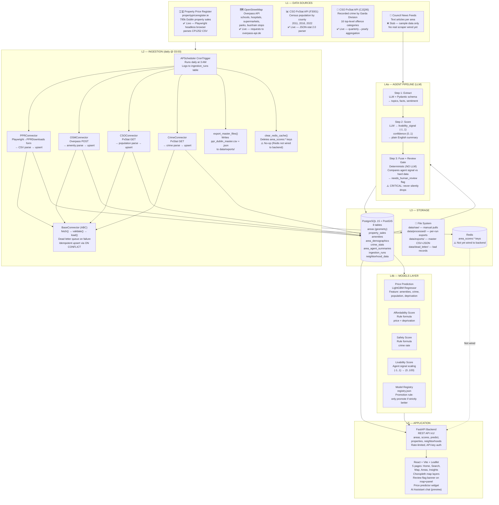

# TerraPulse — Project Discussion for Academic Review

## What Is TerraPulse?

TerraPulse is a data platform that collects, analyses, and visualises information
about housing prices and neighbourhood conditions across Dublin (with the
architecture designed to scale to all of Ireland). The system pulls data from
five different public sources, runs it through validation pipelines, applies
both an LLM-based agent and machine learning models, and serves the results
through a web-based map and search interface.

The core idea: if you want to know whether Dublin 8 is a good place to buy,
you should be able to see not just *average sale prices*, but also *amenities
nearby, crime trends, demographic changes, and a qualitative neighbourhood
summary* — all in one place, updated automatically.

---

## What Has Been Built (the 5-Layer Architecture)

The project is organised into five distinct layers. Data flows strictly from
top to bottom — no circular dependencies.

```
DATA SOURCES  →  INGESTION  →  STORAGE  →  AGENTS + MODELS  →  APPLICATION
   (L1)             (L2)          (L3)            (L4)              (L5)
```

### Layer 1 — Data Sources (what we fetch)

| Source | Status | What It Contains | How We Get It |
|--------|--------|-----------------|---------------|
| **PPR** (Property Price Register) | ✅ Working | ~795,000 Dublin property sales (date, address, price, county) | Downloads a national ZIP file from propertypriceregister.ie, filters for Dublin rows. Uses Playwright headless browser because the site has bot-detection (F5/TSPD challenge). |
| **OSM** (OpenStreetMap) | ✅ Working | Real amenities: schools, hospitals, supermarkets, parks, police stations, bus stops, train stops | Queries the Overpass API with a bounding box around Dublin. Falls back to sample data if the API fails. |
| **CSO** (Central Statistics Office) | ✅ Working (real data) | Census population figures by county/city (table F3001 from PxStat API) | Previously was a stub with fake data. Now fetches real census data from CSO's JSON-stat API — 2011, 2016, 2022 population totals. Still being wired into the area resolution system. |
| **Crime** (Garda statistics, CSO CJQ06) | ✅ Working (real data) | Quarterly recorded crime by Garda Division and offence category (16 top-level types) | Previously a stub. Now fetches real data from CSO's PxStat API — aggregates quarterly data into yearly totals per Garda Division. |
| **Council News** (text sources for the agent) | ❌ Stub | Raw text articles about development, crime, amenities, transport for each Dublin area | Currently returns hand-authored realistic sample articles. No real scraping target wired yet (Dublin City Council / South Dublin County Council don't expose a stable machine-readable news API). |

### Layer 2 — Ingestion

Every connector follows a strict **fetch → validate → load** pattern:

1. **Fetch**: Download raw data from the source
2. **Validate**: Check each record against a Pydantic schema (strict typing)
3. **Load**: Upsert into PostgreSQL using a natural-key `ON CONFLICT` constraint
   (so re-running never creates duplicates)
4. **Dead Letter Queue**: Any record that fails validation or DB insertion is
   written to `data/dead_letter/` as JSON for later inspection — the pipeline
   never crashes on a bad record.

A scheduler (`APScheduler`) runs all connectors daily at 3 AM. Each run:
- Creates an `ingestion_runs` log entry in Postgres
- Runs the PPR, OSM, CSO, and Crime connectors
- Regenerates the master export files (`data/exports/ppr_dublin_master.csv` + `.json`)
- Attempts to clear Redis cache (currently a no-op since Redis is not yet wired to the backend)
- Logs rows fetched, upserted, and dead-lettered

### Layer 3 — Storage

- **PostgreSQL + PostGIS**: 8 tables (`areas`, `property_sales`, `amenities`,
  `area_demographics`, `crime_stats`, `area_agent_summaries`, `ingestion_runs`,
  `neighborhood_data`)
- **Redis**: Configured but not yet actively used by the backend for caching
  (scores are computed live from Postgres on each request)
- **File Exports**: Master CSV/JSON written to `data/exports/` after every
  ingestion run — meant for sharing with you (the professor) for manual review

### Layer 4 — Agents + Models

**The Agent Pipeline** (Extract → Score → Fuse):

This is the "AI" part. It processes unstructured text (council news articles,
local reports) through a 3-step LLM pipeline:

1. **Extract**: The LLM reads raw text and extracts structured data — topics,
   key facts, sentiment, mentioned entities. Uses a Pydantic schema to force
   JSON output.
2. **Score**: The LLM aggregates all extractions for an area into a single
   livability signal (-1.0 to 1.0), with a confidence score (0.0 to 1.0), and
   produces a 2-3 sentence plain-English summary.
3. **Fuse + Review Gate**: A deterministic (NO LLM call) step compares the
   agent's qualitative signal against hard data (crime trends, price trends).
   If they disagree significantly, it sets `needs_human_review = True` — a flag
   that flows all the way to the frontend UI and renders an unmissable warning
   banner. This is a **critical safety feature**: the system never silently
   averages a dubious qualitative signal into a clean score.

The LLM client uses **OpenRouter/Groq with free open-source models** (Llama 3,
Qwen, Hermes) — no paid API key required. It falls back across multiple models
if the primary one is rate-limited, ensuring the pipeline can run at zero cost.

**The Models Layer** (machine learning + scoring):

Four model types with a promotion rule ("only promote if strictly better"):

| Model | Type | Formula |
|-------|------|---------|
| **Price Prediction** | LightGBM (gradient-boosted trees) | Trained on area features → predicts avg sale price with confidence interval |
| **Affordability Score** | Rule-based formula | `max(0, 100 - (avg_price/10000 * 0.6) - (deprivation_index * 10 * 0.4))` |
| **Safety Score** | Rule-based formula | `max(0, 100 - (crime_rate * 2))` — crime rate = total_crime / population * 1000 |
| **Livability Score** | Blend of agent signal | Scales the agent's livability_signal (-1..1) to 0..100 |

### Layer 5 — Application

**Backend (FastAPI)**:
- REST API with endpoints for areas (`/v1/areas/`), scores (`/v1/areas/{id}/score`),
  price predictions (`/v1/predict/price`), properties, and neighborhoods
- Rate limiting, request logging, CORS, API key authentication
- Score service computes affordability, safety, and livability on-the-fly from
  Postgres data and active model registry metadata
- The `needs_human_review` flag is preserved end-to-end from the agent pipeline
  through to the API response — never dropped

**Frontend (React + Vite + Leaflet/Google Maps)**:
- 5 pages: Home, Search, Map, Areas Directory, Insights
- Interactive map with choropleth layers (price, affordability, safety, livability)
- Area detail panel with scores, agent summary, review flag banner
- Price predictor widget, property listings, AI assistant chat widget (preview)
- Works fully with mock data when the backend is unavailable

---

## Architecture Diagram (Full System)



---

## Data Flow Summary (End-to-End Trace)

Following one piece of data through the system:

1. **PPR connector downloads** a national ZIP file, filters for Dublin rows,
   parses the CSV, validates each row's date/price/address against a Pydantic
   schema, resolves the Dublin postal district from the address, and upserts
   into `property_sales` via `ON CONFLICT DO UPDATE` keyed on
   (sale_date, address_raw, price_eur).

2. **OSM connector queries** the Overpass API for amenity nodes within the
   Dublin bounding box, maps them to `amenities` table, upsert on
   (osm_id, amenity_type).

3. **CSO connector fetches** the F3001 population cube from the PxStat API,
   filters to "Both sexes, All marital status" totals per county, parses the
   JSON-stat 2.0 format, and upserts into `area_demographics`.

4. **Crime connector fetches** the CJQ06 crime cube from the PxStat API,
   sums quarterly data to yearly totals per Garda Division per top-level
   offence category, and upserts into `crime_stats`.

5. **Agent pipeline** reads the latest area summaries from Postgres, plus
   council news text files, feeds them through Extract→Score→Fuse, and
   writes `area_agent_summaries` with the `needs_human_review` flag.

6. **Models layer** reads area features from Postgres, trains/promotes
   models via the registry, and the backend loads active model metadata
   to compute scores on-the-fly.

7. **Backend API** serves `GET /v1/areas/{id}/score` which queries property
   sales, crime stats, demographics, and agent summaries in a single SQL
   query, computes affordability/safety/livability scores, and returns them
   with `needs_human_review` intact.

8. **Frontend** renders the area polygon on a map coloured by the selected
   score type, shows the review flag banner if set, and displays the agent
   summary, price predictor, and listings.

---

## What Is the Agentic Architecture?

The term "agentic" here means the system uses an **LLM-driven pipeline** that
autonomously processes unstructured text and makes qualitative judgments about
neighbourhoods — *without a human having to read each article*. The agent:

1. **Reads** text sources (council news) about a specific area
2. **Extracts** structured information (topics like "development" or "crime_incident",
   sentiment, key facts) using an LLM guided by a Pydantic schema
3. **Scores** the area's livability trajectory on a scale of -1.0 to 1.0,
   with a confidence level
4. **Fuses** the qualitative result with hard data — and if they disagree,
   flags the result for human review rather than silently mixing them

The key design decisions:
- **No paid LLM dependencies**: Uses open-source models (Llama 3, Qwen) via
  OpenRouter's and Groq's free tiers
- **Deterministic review gate**: The final comparison between agent output and
  structured data is hardcoded logic, not another LLM call — so it's predictable
  and testable
- **`needs_human_review` is inviolable**: It flows unmodified from the agent
  pipeline through the database, through the API, and into the frontend UI.
  The system never silently averages a flagged score into a clean result.

---

## Current Status: What Works vs What Doesn't

### ✅ Fully Working

- **PPR ingestion**: Downloads real Dublin property sales, validates, upserts
- **OSM ingestion**: Fetches real amenities from Overpass API
- **CSO ingestion**: Fetches real census population data from PxStat API (F3001) — recently fixed from stub
- **Crime ingestion**: Fetches real Garda crime data from PxStat API (CJQ06) — recently fixed from stub
- **Master export**: Generates `data/exports/ppr_dublin_master.csv` + `.json`
  with all required columns — opens cleanly in Excel (UTF-8)
- **Scheduled refresh**: APScheduler runs daily at 3 AM, logs to `ingestion_runs`
- **Documented integration trace**: End-to-end test through all 5 layers verified working
- **Migration runner**: `run_migrations.py` applies SQL files in order with
  deduplication tracking
- **Agent pipeline**: Extract→Score→Fuse works end-to-end with LLM calls
- **Backend API**: All endpoints serve correct data, review flag passes through
- **Frontend**: All pages render, map layers work, review flag banner shows,
  mock data mode functional, tests pass

### ⚠️ Stubs / Gaps

- **Council news connector**: Returns hand-authored sample data. No real scraper
  for Dublin City Council / South Dublin County Council news feeds
- **Redis caching**: Configured and invalidation code exists, but the backend
  computes scores live from Postgres on every request — Redis is not actually
  used. The cache invalidation in `scheduled_refresh.py` is a no-op.

### ❌ Blockers / Not Runnable in Current Environment

- **PostgreSQL (port 5432) and Redis (port 6379) are not running** — the local
  machine has no Docker or Postgres service
- **Python virtual environment is broken** — `.venv/bin/pip` missing, no
  dependencies installed
- **Migrations only run via explicit command** — there is no automated migration
  runner wired into backend startup, though `run_migrations.py` exists

---

## Open Challenges

### 1. PPR Download Inefficiency
The connector downloads the full `PPR-ALL.zip` (~18 MB, 795k rows) every run
just to filter for Dublin. A better approach would be:
- Use the county-filtered download form on the PSRA site (which returns only
  Dublin data) — this was the original intention of the Phase 9 spec, but
  the Domino site has F5 bot challenges that prevent simple `requests`-based
  form submission. Playwright was introduced as a solution but the form-based
  download proved unreliable.
- Alternatively, implement incremental ingestion by tracking the latest
  `sale_date` seen and only fetching new records.

### 2. PPR Rows Not Geocoded
The `property_sales` table has NULL values for `area_id`, `lat`, and `lon` on
most rows. While `resolve_area_id_from_address()` exists in `geocoding.py`, it
has limited coverage — only Dublin postal districts are reliably matched.
A proper geocoding step (using OpenStreetMap's Nominatim or a local address
index) is needed to link property sales to the correct area for scoring.

### 3. CSO/Crime Area Resolution Mismatch
CSO population data is at the county/city level (Dublin City, Fingal, etc.),
while our `areas` table is seeded at the postal-district level (Dublin 1,
Dublin 2, etc.). Similarly, crime data is at the Garda Division level. This
granularity mismatch means many records cannot be linked to a specific area
and stay at `area_id = NULL`. Resolving this requires either:
- Aggregating scores at a coarser level
- Finding more granular data sources
- Using a spatial join to link Garda Division names to postal districts

### 4. Real Council News Scraping
The agent pipeline's effectiveness depends entirely on the quality and breadth
of its text sources. Currently it runs on hand-authored sample articles. A real
scraper for Dublin City Council, Dun Laoghaire-Rathdown, Fingal, and South
Dublin County Council news feeds is needed but no stable machine-readable API
has been identified.

### 5. Environment Runnable
The system cannot be started end-to-end in the current development environment
because Postgres, Redis, and the Python dependencies are not set up. A
`docker-compose up` command should bring everything online, but Docker is not
available on this machine.

### 6. Redis Cache Not Wired
Section 5 of the AGENTS.md spec requires Redis cache invalidation after
ingestion runs, but the backend currently doesn't cache anything in Redis —
scores are computed live from Postgres on every API call. Either:
- Wire Redis caching into the backend score service (it already has the
  `cache_get`/`cache_set` primitives in `cache.py`) and set appropriate TTLs
- Or remove the dead invalidation code and document that scores are live-computed

### 7. Data Source Coverage Gaps
Of the 13 metric categories identified in the project's source catalog, only
PPR (property sales) and OSM (amenities) are fully operational. CSO and Crime
were recently upgraded from stubs to real data. Missing:
- CSO RPPI (Residential Property Price Index by Eircode — separate from PPR transactions)
- CSO Census SAPS (Small Area Population Statistics — demographics at finer granularity)
- NTA GTFS/GTFS-R (transport links, commute times)
- Dublin planning portals (active construction projects)
- Dublin City Council flood maps
- School counts (Dept of Education, Schooldays.ie)

### 8. Per-Run Export File Buildup
The connector writes per-run CSV and JSON files to `data/processed/ppr/` with a
retention policy of only the 10 most recent, but the `manual_pulls/` and
`data/exports/` directories add redundancy. The master export is the canonical
file for sharing with you (the professor), but confusion about which file is
authoritative is a real usability issue for anyone new to the project.

---

## Summary for the Professor (Plain English)

**What we built**: A data platform that automatically collects and analyses
information about Dublin neighbourhoods — property sale prices, schools,
hospitals, parks, crime statistics, population data, and local news — and
presents it all on an interactive map with neighbourhood scores and an
AI-generated summary.

**How it works**:
1. Every night at 3 AM, automated scripts download fresh data from government
   websites and OpenStreetMap
2. The data is checked for errors and stored in a spatial database (PostgreSQL
   with PostGIS)
3. An AI pipeline reads local news articles (currently sample data) and generates
   summaries and livability scores for each neighbourhood
4. Statistical models compute affordability and safety scores from the structured
   data
5. A web application lets you view everything on an interactive map — click any
   neighbourhood to see its scores, AI summary, recent sales, and price predictions

**Key design decisions**:
- **No paid AI services**: All AI processing uses free, open-source LLMs
- **Safety-first review system**: When the AI's qualitative assessment disagrees
  with the hard data, it visibly flags the result for human review rather than
  silently blending them
- **Idempotent ingestion**: Running the pipeline multiple times never creates
  duplicate data
- **End-to-end traceability**: Every piece of data can be traced from its source
  through every processing step to the final user interface

**What remains to be done**:
- The automatic geocoding of property addresses to map coordinates is incomplete
  — most sales are in the database but not yet linked to a specific neighbourhood
- Population data is available only at the city level, not the neighbourhood level
- The AI pipeline needs real news feeds to scrape instead of sample articles
- The system cannot be started with a single command in the current environment
  (needs Docker for Postgres/Redis)
- Several planned data sources (transport links, planning applications, schools)
  have not yet been connected
